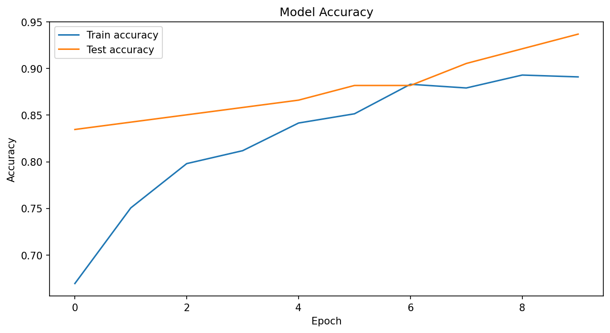
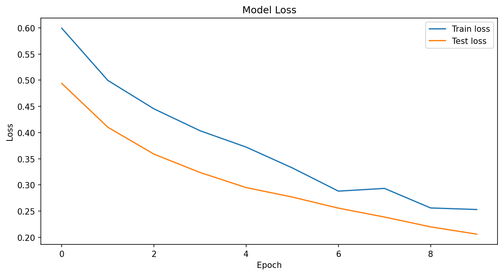
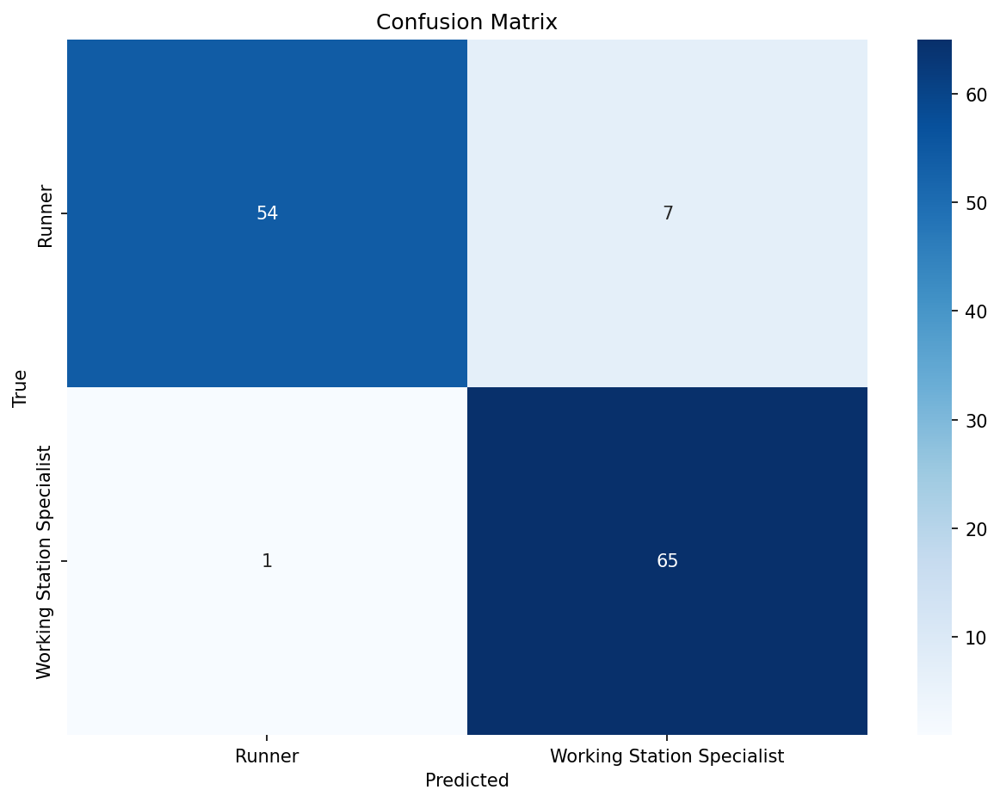

# Hyrox Athlete Classifier

Elite Hyrox athlete classification based on performance patterns in runs and workstations.

This project blends sport, data, and deep learning. It starts from a simple but powerful question:
Which Elite Hyrox athlete does your performance style resemble?

The app takes a person's times for each workstation and run interval and predicts which circuit athlete their performance pattern most closely matches.

## Goals

I'm a hybrid athlete who enjoys Hyrox and strength-endurance sports. I wanted a technical project that connects with a personal interest and is concrete enough to include in my professional portfolio.

Additionally, I aimed to:
- build a classification model with TensorFlow
- produce visualizations that demonstrate the model's effectiveness

## What does the model do?

The model receives workstation and run times:
Run 1, SkiErg
Run 2, Sled Push
Run 3, Sled Pull
Run 4, Burpee Broad Jump
Run 5, Row
Run 6, Farmer Carry
Run 7, Sandbag Lunges
Run 8, Wall Balls

It predicts the Elite Hyrox athlete archetype that best matches the performance pattern (Runner or Working Station Specialist).

## Dataset

The dataset was generated using real data obtained from the TrainRox website.

## Athlete Classification

The model classifies athletes into two main categories based on performance:
- **Runner**: Athletes with superior performance in the running sections.
- **Working Station Specialist**: Athletes who excel in the workstations.
The decision is based on analyzing workstation and run interval times using the z-score formula, $z = \frac{X - \mu}{\sigma}$, to standardize the data and classify according to relative performance.

## Model Architecture

The model is a feedforward neural network built with TensorFlow and Keras. The architecture includes:
- Dense layers with ReLU activation functions.
- Dropout layers to prevent overfitting.
- Output layer with softmax activation for multiclass classification.

## Results

The model built to classify between Runner and Working Station Specialist achieved strong overall performance, with 89% accuracy on the test set.

### Training Performance




The accuracy chart shows the model's training progression, with test accuracy reaching ~94% by the final epoch. The loss chart demonstrates steady convergence, with test loss decreasing from ~0.49 to ~0.20.

### Classification Metrics

By class, the results show healthy balance:

Runner: precision 0.93, recall 0.84, f1-score 0.88

Working Station Specialist: precision 0.86, recall 0.94, f1-score 0.90

This shows the model is particularly effective at correctly identifying Working Station Specialists (high recall) while maintaining very good precision for Runners. Macro and weighted averages are consistent (0.89 in all cases), indicating stability and no major bias towards a single class.

### Confusion Matrix



The confusion matrix above visualizes the model's predictions on the test set:
- **True Runners correctly identified:** 54 out of 61 (recall: 0.84)
- **True Working Station Specialists correctly identified:** 65 out of 66 (recall: 0.94)

## How to Run

- Create and activate a virtual environment:

```bash
python -m venv venv
source venv/bin/activate
```

- Install dependencies:

```bash
pip install -r requirements.txt
```

- Recompute specialties (optional):

```bash
python ./src/scripts/recompute_specialty.py
```

- Run the exploration notebook:

```bash
code -r notebooks/01_exploration.ipynb
```

- Train and save model artifacts (example script coming next):

```bash
python ./src/scripts/train_and_save.py
```

- Predict from a CSV using saved artifacts:

```bash
python ./src/scripts/predict_from_csv.py --input data/test_predict.csv
```
